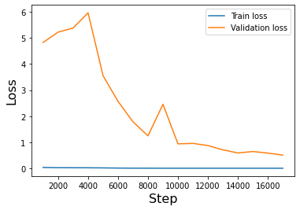

# Transformer
A Transformer model to solve mathematical problems.

## Dataset
The dataset is a subset of the DeepMind mathematical dataset,
in which each example consists of a question and the answer.

There are three different modules, and for each I will present
an example of question and answer.
- _numbers - place value_
  - Question: "What is the ten thousands digit of 94576916?"
  - Answer: "7"
- _comparison - sort_
  - Question: "Sort -3, 52, -1, -49, 1, 4, -2 in descending order."
  - Answer: "52, 4, 1, -1, -2, -3, -49"
- _algebra - linear\_1d_
  - Question: "Solve -1004*k - 10471 + 2408 - 15049 = -362\*k for k."
  - Answer: "-36"

## Layers
This model has the following layers:
- 1 x Embedding layer
- 1 x Positional encoder
- 3 x Encoder layer
- 2 x Decoder layer
- 1 x Fully connected layer

## Model
In using `attention` we need to be careful, since some positions are not valid (the attention should not have access to them).
That is why I used `create_src_padding_mask` and `create_tgt_padding_mask` functions inside the `Transformer` class.

Model parameters:
- loss function: `Cross Entropy Loss`.
- `batch size = 640`. To simulate a large batch size, I accumulated gradients every 10 steps.
Considered that the batch size is 64, it is like using a final batch size of 640.
- `learning rate = 1e-4` with `Adam optimizer`.
- `clipping rate = 0.1`.
- `attention heads = 8`.
- `feed-forword = 1024`.
- `hidden dimension = 256`.

## Train
I created a Trainer class that takes care of the training and validation steps.

## Main
- `text_data_properties` is a function that print some properties of the data.
- `run` is the function that run the model with the default values `(d_model=256, dim_feedforward=1024, task=TASK[0], stop_accuracy=90, n=200)`

## Results
Some important considerations:
- I used `greedy search` to obtain predictions.
- During accuracy computation, we consider a model prediction as correct, only when the entire output sequence (and so all characters) match the ones of the correct answer.
- For computing validation accuracy and loss I did not use the teacher forcing, since I fed the model with its own predictions.
- We stopped a prediction when one of the following stopping criteria is met:
  - the output is the end-of-sentence token, eos.
  - the length of the output sequence exceeds the one of the target sequence.

### Numbers - Place Value Module
The model reach `91.15 %` of validation accuracy after `13.6867 minutes` and after `1400 iterations`.

These are three examples from the validation set and the predictions made by the trained model:
- What is the units digit of 66919584?:
  - Prediction:\[’\<sos>’, ’4’, ’\<eos>’].
  - Correct answer: 4.
- What is the ten thousands digit of 94576916?:
  - Prediction:\[’\<sos>’, ’7’, ’\<eos>’].
  - Correct answer: 7.
- What is the hundreds digit of 54869313?:
  - Prediction:\[’\<sos>’, ’3’, ’\<eos>’].
  - Correct answer: 3.

### Comparison - Sort Module
The model reach `90.71%` of validation accuracy after `17000 iterations` and `252 minutes`.

These are three examples from the validation set and the predictions made by the trained model:
- Sort -1/2, 1/4, 1, 88, 2/889.:
  - Prediction: \[’\<sos>’, ’-’, ’1’, ’/’, ’2’, ’,’, ’ ’, ’2’, ’/’, ’8’, ’8’, ’9’, ’,’, ’ ’, ’1’, ’/’, ’4’, ’,’, ’
  ’, ’1’, ’,’, ’ ’, ’8’, ’8’, ’\<eos>’, ’\<pad>’, ’\<pad>’, ’\<pad>’, ’\<pad>’, ’\<pad>’, ’\<pad>’,
  ’\<pad>’].
  - Correct answer: -1/2, 2/889, 1/4, 1, 88.
- Sort -3, 52, -1, -49, 1, 4, -2 in descending order.:
  - Prediction: \[’\<sos>’, ’5’, ’2’, ’,’, ’ ’, ’4’, ’,’, ’ ’, ’1’, ’,’, ’ ’, ’-’, ’1’, ’,’, ’ ’, ’-’, ’2’, ’,’, ’ ’, ’-’,
’3’, ’,’, ’ ’, ’-’, ’4’, ’9’, ’\<eos>’, ’\<pad>’, ’\<pad>’, ’\<pad>’, ’\<pad>’, ’\<pad>’].
    - Correct answer: 52, 4, 1, -1, -2, -3, -49.
- Put -2/13, 0.1, 4, -1, -1286, -9 in ascending order.:
  - Prediction: \[’\<sos>’, ’-’, ’1’, ’2’, ’8’, ’6’, ’,’, ’ ’, ’-’, ’9’, ’,’, ’ ’, ’-’, ’1’, ’,’, ’ ’, ’-’, ’2’, ’/’, ’1’,
  ’3’, ’,’, ’ ’, ’0’, ’.’, ’1’, ’,’, ’ ’, ’4’, ’\<eos>’, ’\<pad>’, ’\<pad>’].
  - Correct answer: -1286, -9, -1, -2/13, 0.1, 4.

### Algebra - Linear 1D Module
Due to Colab usage limits I wasn't able to achieve a good accuracy before reach the limit (6 hours), these are the results after `6 hours` and so
after `80000 iterations`:
- `train loss: 0.015188`,
- `train accuracy: 56.83 %`,
- `validation loss: 0.823757`,
- `validation accuracy: 0.00 %`.

An example of prediction was: "Solve -12\*s + 45 + 3 = -34\*s + 7*s + 18 for s." and the
answer was: "\[’\<sos>’, ’-’, ’2’, ’\<eos>’, ’\<pad>’, ’\<pad>’]" which is the correct answer since
`-2` solve the equation.